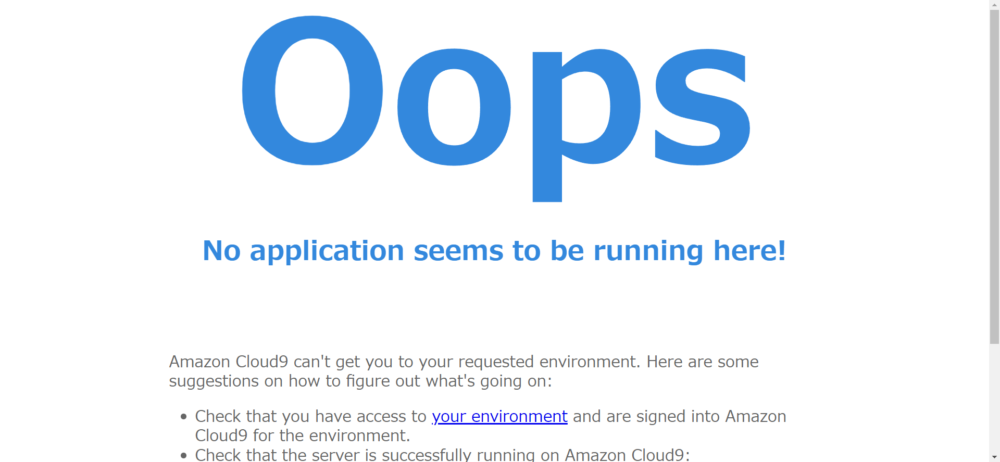
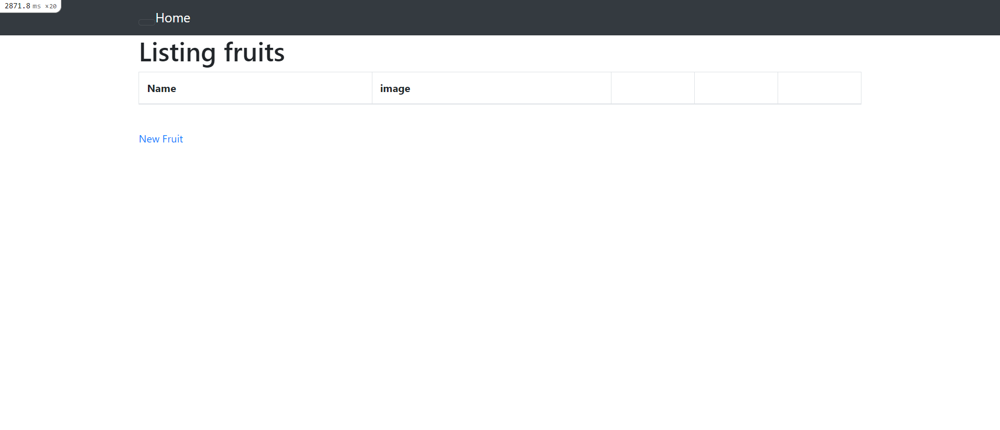
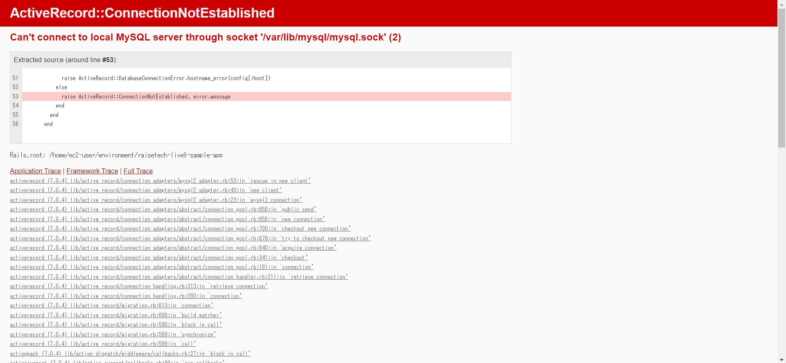

# 第3回課題

### APサーバーについて
**APサーバーの名前とバージョンは？**
- Puma 5.6.5

**APサーバーを終了させた場合引き続きアクセスできるか？**
- A.アクセスできない

**APサーバーを再起動した後はどうなるか？**
- A.アクセスできる

### DBサーバーについて
**DBサーバーの名前とバージョンは？**
- MySQL 8.0.33

**DBサーバーを終了させた場合引き続きアクセスできるか？**
- A.できない

**Railsの構成管理ツールの名前は？**
- Bundler

### 今回の課題から学んだこと
- Webアプリケーションとはブラウザ上で動作するもの。多岐に渡る技術が必要で、チームで開発することが多い。
- システム開発で有名なプロセスモデルには「**V字モデル**」と「**W字モデル**」があり、現在は「**V字モデル**」がよく扱われる。
- すぐにアプリケーション開発をできるものとしてフレームワークがあり、Rubyを言語として選定した場合「**Ruby on Rails**」がほとんどの現場で利用されている。
- 外部ライブラリは便利な機能を集めたパッケージで、Railsを動かす際は「**Gem**」を複数インストールする必要がある。
- 昨今のWeb開発では外部ライブラリを手動で追加することはあまりなく、**構成管理ツール**を利用する。
- **アプリケーションサーバー**とは、RubyやJavaのようなプログラムで作られたアプリケーションを実行する為に必要なサーバー。
- **DB**とは、データを整理して検索しやすくした情報の集まりのことで、**MySQL**や**PostgreSQL**がよく利用されている。
