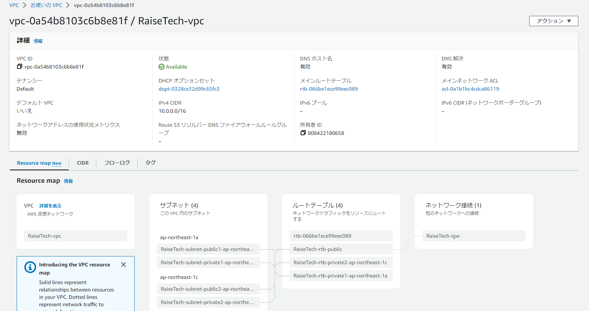
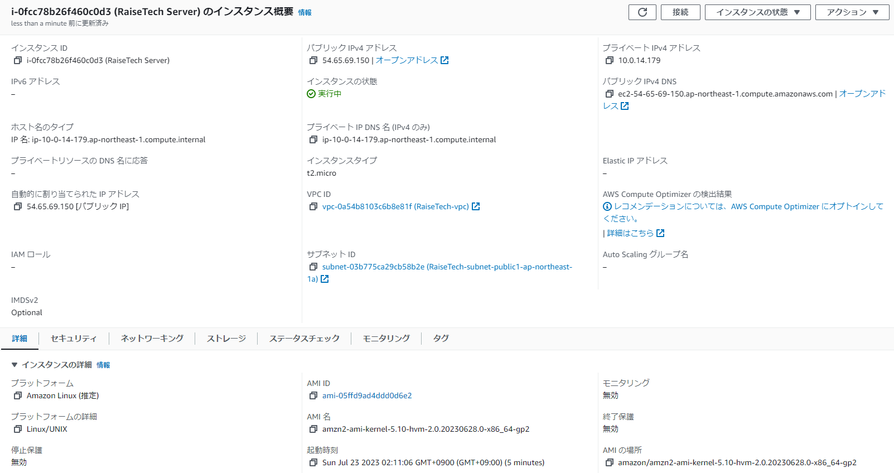
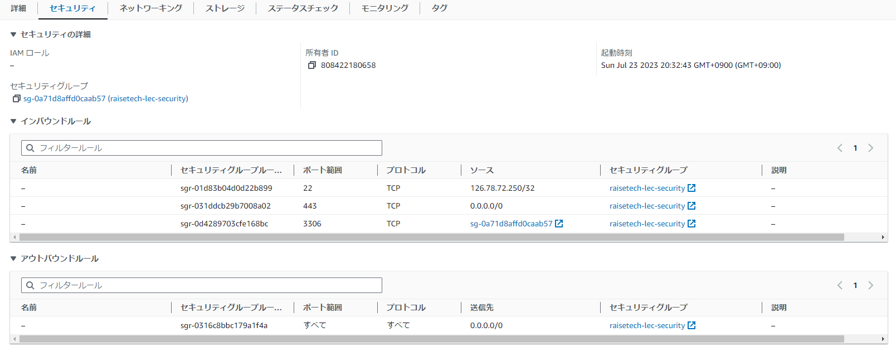
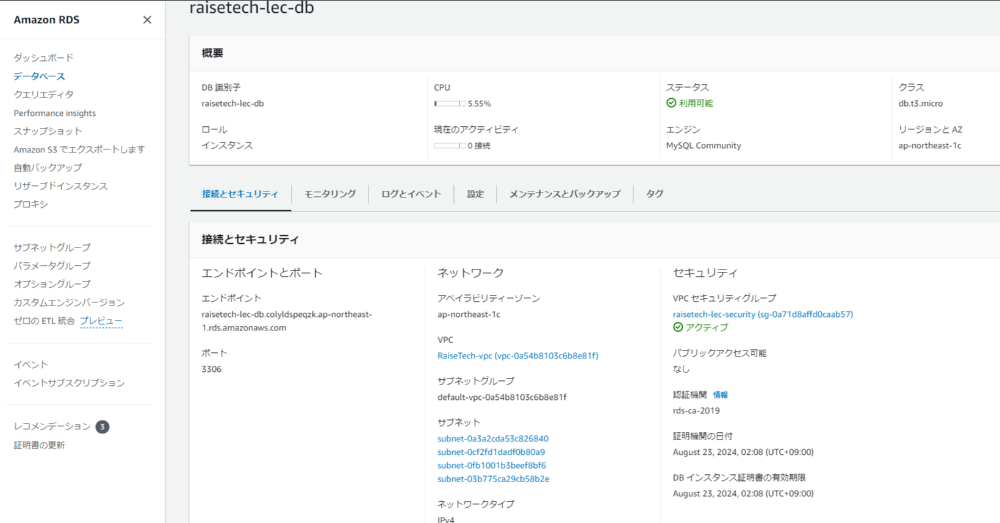
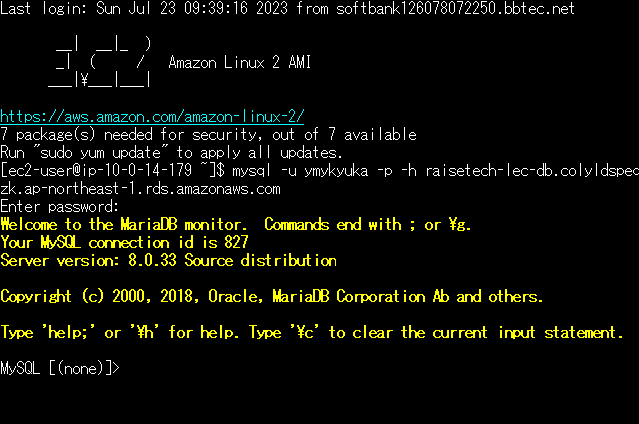

# 第4回課題

## 課題内容

- AWS上に新しくVPCを作成
- EC2インスタンスを作成
- RDSを作成
- EC2からRDSへ接続し、正常であることを確認

### AWS上に新しくVPCを作成

### EC2インスタンスを作成
- EC2のサブネットにprivateのものを設定していたため、EC2へログインできないエラー
  - →publicに変更することにより解決

### RDSを作成

### EC2からRDSへ接続し、正常であることを確認
- Tera TermのSSHでEC2に接続後、RDSへ接続
- セキュリティグループのインバウンドルールにEC2のパブリックIPを設定していたため、
EC2からRDSへ接続できないエラー
  - →EC2のセキュリティグループIDを設定することにより解決

### 今回の課題から学んだこと
- ウィザードに沿うことで、作成自体は比較的容易にできる
- 設定の意味合いを理解していないとエラーの要因になったり、対処に時間を要する
- サブネットやセキュリティグループ、IPアドレス、プロトコル等、理解を深めていきたい